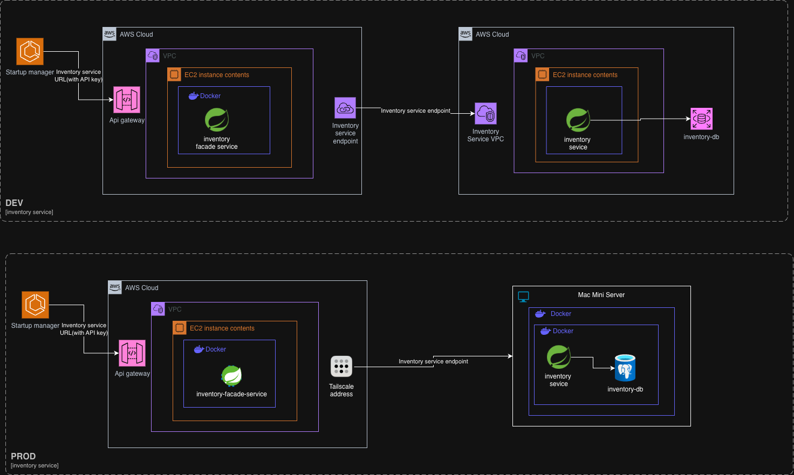

# products_service

# Product Database Design Document

## 1. Executive Summary

Problem Statement
Our organization needs a robust inventory management system to track products across multiple companies, users, locations, and statuses. The current lack of a centralized product database creates inefficiencies in inventory tracking, asset management, and operational visibility.
Proposed Solution
Implement a custom PostgreSQL-based product database system that provides comprehensive inventory tracking capabilities while maintaining full control over data models, business logic, and integration points.

## 2. Requirements

### Functional Requirements

**Core Use Cases**

- Track Items by Company: Query and manage inventory for specific companies
- Track Items by User: Monitor item assignments and user accountability
- Track Item Status: Monitor product lifecycle and status changes
- Track Items by Location: Geospatial inventory management
- Multi-dimensional Tracking: Combine company, location, and status filters
  **Security Requirements**
- Row-level security for multi-company data isolation
- API authentication and authorization
- Data encryption at rest and in transit

## 3.Options

### Option 1: Create our own service

**Pros**

- **Tailored to Unique Requirements:** You design your schema and business logic from the ground up—ensuring it perfectly supports custom workflows, edge scenarios, and domain-specific quirks your market demands
- **No Licensing Costs**
- **Absolute Control**
  Complete control over schema, data models, features
- **Easy integration:** Built-in native connectivity to your ERP, CRM, or warehouse systems—no need for adapters or middleware. You own the endpoints, field mapping, and transfer format.
  **Cons**
- **Heavy Development Investment**
  Requires substantial development time and upfront cost.
- **Ongoing Maintenance Burden:** You’re responsible for feature velocity, schema evolution, bug resolution, performance tuning, and backups—essentially running your own PIM operation .
- **Limited Support** Without a vendor or a large community, trouble‐shooting falls on our internal team
- **Risk of Reinventing:** You’ll be re‑engineering established functionality like variant generation, auditing, asset handling—work already solved in commercial products.

### Postgres

**Tables**
CREATE TABLE manufacturer (
id UUID PRIMARY KEY DEFAULT uuid_generate_v4(),
name VARCHAR(150) NOT NULL,
address TEXT,
contact VARCHAR(255),
created_at TIMESTAMP DEFAULT now(),
updated_at TIMESTAMP DEFAULT now()
);

CREATE TABLE category (
id UUID PRIMARY KEY DEFAULT uuid_generate_v4(),
name VARCHAR(150) NOT NULL,
created_at TIMESTAMP DEFAULT now(),
updated_at TIMESTAMP DEFAULT now()
);

CREATE TABLE sku (
id UUID PRIMARY KEY DEFAULT uuid_generate_v4(),
sku VARCHAR(50) UNIQUE NOT NULL,
created_at TIMESTAMP DEFAULT now(),
updated_at TIMESTAMP DEFAULT now()
);

CREATE TABLE product (
id UUID PRIMARY KEY DEFAULT uuid_generate_v4(),
manufacturer_id UUID REFERENCES manufacturer(id),
category_id UUID REFERENCES category(id),
sku_id UUID REFERENCES sku(id),
name VARCHAR(50) NOT NULL,
description VARCHAR(150),
qr_code BLOB,
account_id UUID,
created_at TIMESTAMP DEFAULT now(),
updated_at TIMESTAMP DEFAULT now()
);

CREATE TABLE inventory_item (
id UUID PRIMARY KEY DEFAULT uuid_generate_v4(),
product_id UUID NOT NULL REFERENCES product(id),
user_id UUID,
status VARCHAR(50),
serial_number VARCHAR(50),
image VARCHAR(255),
latitude DECIMAL(10, 8),
longitude DECIMAL(10, 8),
created_at TIMESTAMP DEFAULT now(),
updated_at TIMESTAMP DEFAULT now()
);

 ```mermaid
 classDiagram
    class MANUFACTURER {
        +UUID id
        +String name
        +String address
        +String contact
        +Timestamp created_at
        +Timestamp updated_at
    }
    class CATEGORY {
        +UUID id
        +String name
        +Timestamp created_at
        +Timestamp updated_at
    }
    class SKU {
        +UUID id
        +String sku_code
        +Timestamp created_at
        +Timestamp updated_at
    }
    class PRODUCT {
        +UUID id
        +UUID manufacturer_id
        +UUID category_id
        +UUID sku_id
        +String name
        +String description
        +Blob qr_code
        +UUID account_id
        +Timestamp created_at
        +Timestamp updated_at
    }
    class INVENTORY_ITEM {
        +UUID id
        +UUID product_id
        +UUID user_id
        +String status
        +String serial_number
        +String image
        +Decimal latitude
        +Decimal longitude
        +Timestamp created_at
        +Timestamp updated_at
    }
    SKU --> PRODUCT : associates
    MANUFACTURER --> PRODUCT : produces
    CATEGORY --> PRODUCT : groups
    PRODUCT --> INVENTORY_ITEM : includes
 ```

**Queries samples**
**Track all items assigned to a user**
SELECT inventory_item.\*, product.name FROM inventory_item JOIN product
ON inventory_item.product_id = product.id
WHERE inventory_item.user_id = '00000000-0000-0000-0000-000000000011';

**Track all items from a specific client**
SELECT inventory_item.\*, product.name
FROM inventory_item JOIN product ON inventory_item.product_id = product.id
WHERE inventory_item.client_id = '00000000-0000-0000-0000-000000000101';

**Track items by Status**
SELECT inventory_item.\*, product.name, status.name FROM inventory_item
JOIN product ON inventory_item.product_id = product.id
JOIN status ON inventory_item.status_id = status.id WHERE status.name = 'ASSIGNED';

**Track items by location from a specific company**
SELECT inventory_item.\*, product.name
FROM inventory_item JOIN product
ON inventory_item.product_id = product.id
WHERE inventory_item.client_id = '00000000-0000-0000-0000-000000000101' AND inventory_item.longitude BETWEEN -84.389 AND -84.387;

**Track items by category**
SELECT inventory_item.\*, product.name, category.name
FROM inventory_item JOIN product
ON inventory_item.product_id = product.id JOIN category ON product.category_id = category.id WHERE category.name = 'Laptop';

### Option 2 - Use an existing Products database:

**Odoo:**
Odoo is a powerful, modular business software platform—often described as an open‑source ERP (Enterprise Resource Planning) suite—that helps organizations manage everything from sales and CRM to inventory, accounting, HR, e‑commerce, manufacturing, and project managementPricing:

**Snipe it:** https://snipeitapp.com/download
Snipe-IT is a free, open-source, web-based asset management system primarily used by IT departments to track hardware, software licenses, and other IT-related assets. It simplifies the process of managing and tracking IT assets by providing features like check-in/check-out, asset maintenance logs, and customizable reports.

**Pros**

- **Quick setup with a mature data model**
- **Robust Feature Set:** Benefit from built-in versioning, asset management, taxonomy, data validation, DAM, translation workflows, and other PIM essentials
- **Community & Documentation:** Open-source PIMs have active ecosystems offering plugins, connectors, guides, and shared best practices—reducing your build time
  **Extensible Architecture:** Plug-ins, APIs, and integrations let you tailor systems to your unique workflows, without starting from scratch.

**Cons**

- **Licensing Fees or Hidden Costs**
  Even “free” open-source tools bring expenses: hosting, developer time, security, and possible commercial modules (e.g., Akeneo Growth or Enterprise)
- **Customization Overhead:** Tailoring the system to fit non-standard internal workflows often involves deep integration work and ongoing maintenance.
- **Feature Bloat:** These platforms pack extensive, sometimes unused features—slowing performance and complicating interfaces
- **Performance Overheads:** Generic architectures may not optimize for your traffic or scale—you’ll need to configure infrastructure and caching.
- **Complex Integrations:** You might have to stitch together connectors and APIs, especially for proprietary ERPs or homegrown systems
- **Vendor/License Lock‑In:** Enterprise features in open-source platforms can tie you to vendor contracts and versioning constraints

## 4.Recommendation

Our recommendation is to build our own “Products” table over the use of an external database. Although a third‑party solution might offer some convenience, the subscription costs provide little added value compared to what we’d gain by developing internally. By writing our own table we ensure full customization to our specific data structures—attributes, variants, relationships—retain complete control over performance, security, and integrations, and benefit from predictable long‑term costs without recurring fee and the main advantage for us is to be able to adapt the system to our needs.

### Decision Process

We evaluated several existing solutions for our inventory management needs:

**Alternatives Considered:**

- **Odoo** (https://www.odoo.com/) - Full ERP platform with inventory management
- **Snipe-IT** (https://snipeitapp.com/) - Open-source IT asset management system

**Why existing solutions didn't Fit:**

These platforms were designed as complete software-as-a-service solutions with their own interfaces and workflows. However, our specific requirement was different - we needed a lightweight API service that could integrate with our existing backend infrastructure.

**Our Requirements:**

- Simple API endpoints for database operations
- Direct database access and control
- Easy integration with existing backend services
- Customizable data models and business logic

Since we couldn't find any existing project that provided this focused, API-first approach while allowing the flexibility we needed, we decided to build our own solution.

**Our Solution:**
We created a custom PostgreSQL-based system with 5 core tables that provides exactly the functionality we need through a clean API interface, without the overhead of unnecessary features.

**Which DataBase management system should we use?**
These are all the options and which option we choose. There's multiple options for this db selection.
Let’s first start for the nosql db’s and why they are not great options for this case (Independent of the management system)

Then we should focus on the relational options:

| Requirement                          | Our Use Case Needs                   | NoSQL (DynamoDB, MongoDB, etc.) | Why It’s a Problem                                                           |
 | ------------------------------------ | ------------------------------------ | ------------------------------- | ---------------------------------------------------------------------------- |
| **Relational modeling (FKs, joins)** | Yes                                  | No native joins                 | Our model requires joins and relations                                       |
| **Foreign key constraints**          | Required                             | Not supported                   | Data integrity must be enforced in code                                      |
| **Normalized schema**                | Preferred                            | Must denormalize                | You’d need to embed product info in each inventory_item doc                  |
| **Querying by relations**            | For example, by status, type, etc... | Really complex                  | MongoDB can’t easily say “get all items in status 'IN_STOCK' in a category”  |
| **Multiple ways to filter info**     | Required                             | Requires custom indexes         | Queries like status + location + category need complex workarounds           |
| **Geolocation queries (lat/lng)**    | Optional / useful                    | Limited in some NoSQL engines   | Only MongoDB has reasonable support for this feature                         |
| **Data validation (types, enums)**   | Important                            | Handled manually                | You’ll have to write application-level validation logic                      |
| **Transaction safety**               | Required                             | Limited support                 | Some NoSQL DBs offer atomic writes, but not full ACID transaction guarantees |

### 2. Database Comparison

| Feature / DB                          | PostgreSQL (Self-hosted) | RDS PostgreSQL (AWS)  | Aurora PostgreSQL (Serverless v2) | MySQL (RDS or Aurora) |
 | ------------------------------------- | ------------------------ | --------------------- | --------------------------------- | --------------------- |
| **Managed by AWS**                    | No                       | Yes                   | Yes                               | Yes                   |
| **Horizontal scaling**                | No (manual sharding)     | No                    | Yes (auto-scaling)                | NO                    |
| **Vertical scaling**                  | Yes (restart required)   | Yes                   | Yes (automated)                   | Yes                   |
| **Join support**                      | Yes                      | Yes                   | Yes                               | Yes                   |
| **ACID compliance**                   | Yes                      | Yes                   | Yes                               | Yes                   |
| **Advanced data types (UUID, JSONB)** | Yes                      | Yes                   | Yes                               | Only JSON             |
| **Auto backups / snapshots**          | Manual                   | Yes                   | Yes                               | Yes                   |
| **Failover / High Availability**      | Manual                   | Yes (Multi-AZ)        | Yes (Aurora high availability)    | Yes                   |
| **Startup cost**                      | Free                     | Low                   | Medium (pay-per-use)              | Low                   |
| **Best use case**                     | Local dev, full control  | Easy production setup | Scalable, production-ready        | Simpler schemas       |
| **Recommended for our case?**         | For dev/test             | Good                  | Best overall (on AWS)             | Ideal if lightweight  |

 ---

### Final Database Choice

For the most robust solution, especially if we're looking to scale this project, I'd suggest the Postgres with Aurora Serverless V2 option. It's truly adaptable to the project's needs, no matter the stage. In the early stage, it'll charge based on our requests, which is perfect. But, should the service need to scale, it's also got that on-demand capability. So, if our request volume jumps, we'll handle it without problems thanks to the auto-scale feature. Plus, it comes with built-in JSON and UUID features, which will be incredibly useful here since all our IDs are UUIDs.
Also, although our Spring Boot service needs to run independently of any specific cloud provider, this database choice still aligns with that requirement. We can run the app in any Kubernetes cluster and connect to Aurora through standard JDBC config. Nothing about this setup locks us and our API remains decoupled, and Aurora just becomes a reliable, scalable, cloud-managed backend that we can swap out if needed. It gives us the performance and flexibility now, without limiting us later.


## 5 Set up the application locally
1. Install Homebrew on your computer in case you don’t have it .Go to the next link and follow the instructions to get Homwebrew. [Homebrew](https://brew.sh/)
2. Make sure that you have postgresql installed in your computer.
- Run  this command to check if you have Postgres installed locally
```bash
postgres --version
```
- You should see something like the next lines:
```bash
examplecomputer@MacBook-Air ~ %  postgres --version
postgres (PostgreSQL) 14.18 (Homebrew)
```
- In case you don’t have postgres run the next command:
```bash
brew install postgresql@14
```
3. Install Postgres app
- Go to the next website: [Postgres Application](https://postgresapp.com/)
- Download the latest stable version. This will download a .dmg file.
- Install the application moving the Postgres.app icon into your Applications folder
4. Initialize the sever by double-click in the app icon to launch it. 
NOTE: The first time it runs, it will ask you to "Initialize" a new server. Click Initialize. After that the app will run in the menu and show a green light, indicating the server is Running.
5. Create a new database using the postgres app.
- Click on connect and chose any of the databases that are there by default.
- Run the next command to create a new database:
```sql
CREATE DATABASE your_db_name;
```
**You can also create a database using the terminal:**
```sql
 psql postgres
```
Then run this command: 
```sql
CREATE DATABASE springboot_project_db;
```
To check the databases you have created run this command:
```bash
\l
```

6. To run the application locally substitute the content with the next lines:
```bash
#application.properties
spring.application.name=inventory_system

spring.datasource.url=jdbc:postgresql://localhost:5432/your_db_name
spring.datasource.username=your_db_username
spring.datasource.password=your_db_password
spring.jpa.hibernate.ddl-auto=update
spring.jpa.properties.hibernate.dialect=org.hibernate.dialect.PostgreSQLDialect
```
if you don't set and password you can leave the password field empty.

## 6. Cdk
The AWS Cloud Development Kit (CDK) helps you to provision the entire required AWS environment, serving as the blueprint for the Spring Boot application. For the inventory service, you can find the GitHub repository for the CDK project related to it in the link below.
Repository:
[Cdk Github Repository] (https://github.com/cincinnatiai/cdk_inventory_service)

## 7. Local computer Setup using Docker 
This section will show you how to Setup the Inventory project. 

1. To build the jar file with the project first we need to run the next command:
    - Substitute the data in your application.properties with the next: 
        ```bash
        #application.properties
        spring.application.name=inventory_system
      
        spring.datasource.url=${SPRING_DATASOURCE_URL:jdbc:postgresql://localhost:5432/inventory_db}
        spring.datasource.username=${SPRING_DATASOURCE_USERNAME:DB_USER_CREDENTIALS}
        spring.datasource.password=${SPRING_DATASOURCE_PASSWORD:DB_PASSWORD_CREDENTIALS}
        spring.jpa.hibernate.ddl-auto=update
        spring.jpa.properties.hibernate.dialect=org.hibernate.dialect.PostgreSQLDialect

        authorization.endpoint=${AUTHORIZATION_ENDPOINT:http://localhost:8081}
        authorization.api.key=${SERVICE_API_KEY:dev-api-key}
         ```
    - **Note: Please consult with the backend team about DB_USER_CREDENTIALS and DB_PASSWORD_CREDENTIALS values and substitute them using the real values in the application.properties file**

    - After modify the application.properties run the next command:
    ```bash
   mvn clean package -DskipTests
   ```
2. Create a Dockerfile(if not exist) using the next config: 
    ```bash
    FROM eclipse-temurin:21-jre-alpine
    WORKDIR /app
    COPY target/inventory_system-0.0.6-SNAPSHOT.jar app.jar
    EXPOSE 8080
    ENTRYPOINT ["java", "-jar", "app.jar"]
    ```
3. Create docker-compose.yml.
 
**Note:Please consult with the backend team about DB_USER_CREDENTIALS and DB_PASSWORD_CREDENTIALS values and substitute them using the real values in the docker-compose.yml file**
```yml
version: '3.8'

services:
  database:
    image: postgres:15
    container_name: postgres-db
    environment:
      POSTGRES_DB: inventory_db
      POSTGRES_USER: DB_USER_CREDENTIALS
      POSTGRES_PASSWORD: DB_PASSWORD_CREDENTIALS
    volumes:
      - db-data:/var/lib/postgresql/data
    networks:
      - app-network

  app:
    build: .
    container_name: spring-boot-app
    ports:
      - "8080:8080"
    environment:
      SPRING_DATASOURCE_URL: jdbc:postgresql://database:5432/inventory_db
      SPRING_DATASOURCE_USERNAME: DB_USER_CREDENTIALS
      SPRING_DATASOURCE_PASSWORD: DB_PASSWORD_CREDENTIALS
    depends_on:
      - database
    networks:
      - app-network

networks:
  app-network:
    driver: bridge

volumes:
  db-data:
```
4. In case you are presenting the next error:
    ```bash
    [ERROR] Caused by: The following artifacts could not be resolved: 
    com.cincinnatiai:ssr-java:pom:0.0.1 (absent): 
    Could not transfer artifact com.cincinnatiai:
    ssr-java:pom:0.0.1 from/to github (https://maven.pkg.github.com/nicholaspark09/ssr): 
    status code: 401, reason phrase: Unauthorized (401)
    ```
    - Create .m2 directory:
        ```bash
       mkdir -p ~/.m2
         ```
    - Create and edit setting.xml files:
        ```bash
          nano ~/.m2/settings.xml
        ```
    - Add this configuration to setting.xml, updating the username, and token values with the propper credentials:
        ```xml
        <settings xmlns="http://maven.apache.org/SETTINGS/1.0.0"
                  xmlns:xsi="http://www.w3.org/2001/XMLSchema-instance"
                  xsi:schemaLocation="http://maven.apache.org/SETTINGS/1.0.0
                              http://maven.apache.org/xsd/settings-1.0.0.xsd">
              <servers>
                  <server>
                      <id>github</id>
                      <username>YOUR_GITHUB_USERNAME</username>
                      <password>YOUR_GITHUB_TOKEN</password>
                  </server>
              </servers>
        </settings>
      ```
5. Run the next command to start the container, create the database, run and build our Springboot application: 
    ```bash
    docker-compose up --build
    ```
6. Access to docker desktop application or run the next command to check if the containers are up and running:
    ```bash 
   docker ps
    ```
   You should see something like this:
   ```bash
    CONTAINER ID   IMAGE                   COMMAND                  CREATED        STATUS                 PORTS                                         NAMES
    64b101978a9e   inventory_service-app   "java -jar app.jar"      3 hours ago    Up 3 hours             0.0.0.0:8080->8080/tcp, [::]:8080->8080/tcp   inventory-spring-boot-app
    c30f0774ade1   postgres:15             "docker-entrypoint.s…"   3 hours ago    Up 3 hours             5432/tcp                                      postgres-inventory-db
    ```
   

7. You can run the next command on postman to test teh connection:
    - http://localhost:8080/actuator/health
        - Expected response:
            ```json
          {
             "status": "UP"
          }
           ```
    - Try one of the inventory project endpoints, for example:
        - http://localhost:8080/api/categories
        - http://localhost:8080/api/products
        - http://localhost:8080/api/inventory-items
            - Expected answer for first time:
               ```json
              []
              ```
      
## 8. Architecture System Diagram
